# 👋 Hi, I'm Vijayaragavan G

<div align="center">


<br>


</div>

---

## 🧑‍💻 About Me

I'm **Vijayaragavan G**, a **3rd-year B.E. Computer Science (Cyber Security) student** at **Sri Shakthi Institute of Engineering and Technology**.

Currently, I'm focusing on **Cloud Computing and DevOps**, while continuing to build my Cyber Security fundamentals through practical projects.

- ☁️ Learning **AWS & Cloud fundamentals**
- ⚙️ Learning **Git, GitHub, Jenkins & GitHub Actions**
- 🔄 Exploring **CI/CD pipelines**
- 🔐 Interested in Cyber Security
- 🚀 Learning by building real projects

---

## 🛠️ Tech Stack

<div align="center">


<br><br>


<br><br>


</div>

---

## ☁️ Currently Learning

<div align="center">

| ☁️ Cloud | ⚙️ DevOps | 🔐 Security |
|:---:|:---:|:---:|
| AWS | Git | Cyber Security |
| EC2 | GitHub | Linux |
| S3 | Jenkins | Networking |
| IAM | GitHub Actions | Security Fundamentals |
| | CI/CD | |

</div>

---

# 🚀 Featured Projects

### ☁️ HostVault
**Self-hosted Private Cloud Storage**

A private cloud storage platform built with Flask, PostgreSQL, MinIO and Nginx.

**Status:** ✅ Completed

**Tech:** `Python` `Flask` `PostgreSQL` `MinIO` `Nginx`

🔗 [View Repository](https://github.com/vijay-1806/hostvault)

---

### ⛓️ Blockchain Log Verifier
**Blockchain-based Log Integrity**

A project exploring blockchain for verifying log integrity and detecting unexpected changes.

**Status:** ✅ Completed

**Tech:** `Blockchain` `Ethereum` `Smart Contracts`

🔗 [View Repository](https://github.com/SurendiranBJ/Block_chain-log-Verifier)

---

### 🧬 Biometrics Authentication
**Behavioral Biometrics & LMS**

Currently working on an LMS project exploring behavioral biometrics and user activity patterns.

**Status:** 🚧 In Progress

**Tech:** `React` `Node.js` `Express` `MongoDB` `JWT`

🔗 [View Repository](https://github.com/vijay-1806/Biometrics-Authentication)

---

## 🎯 My Current Journey

<div align="center">

```text
🔐 Cyber Security
       ↓
☁️ Cloud Fundamentals
       ↓
🚀 AWS
       ↓
🔧 Git & GitHub
       ↓
⚙️ Jenkins + GitHub Actions
       ↓
🔄 CI/CD
       ↓
☁️ Cloud + DevOps
```

</div>

---

## 📊 GitHub

<div align="center">





<br><br>

</div>

---

## 🐍 Contribution Activity

<div align="center">


</div>

---

## 📫 Connect With Me

<div align="center">

<a href="mailto:vijayaragavan183@gmail.com">

</a>

<a href="https://www.linkedin.com/in/vijayaragavan-g-75591b338">

</a>

<a href="https://github.com/vijay-1806">

</a>

<a href="https://vijay-1806.github.io">

</a>

</div>

---

<div align="center">

### 🚀 Learn • Build • Improve

</div>
